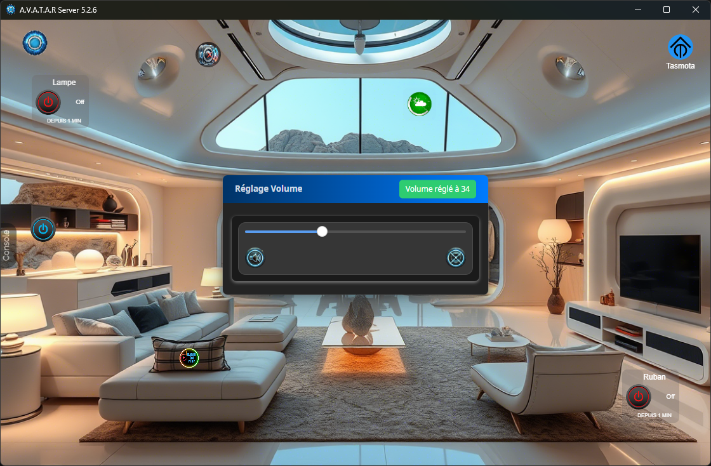
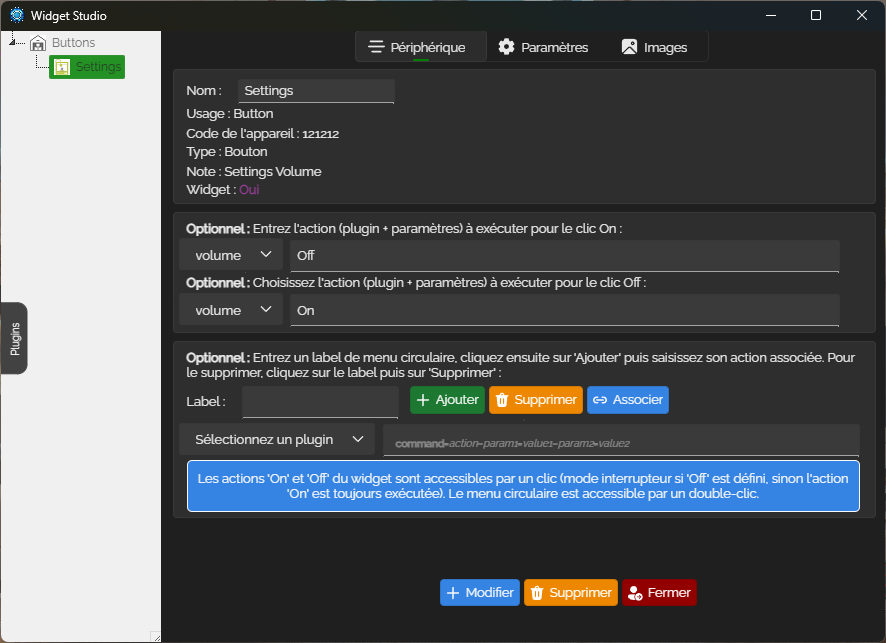

# Plugin Volume

<div align-text:"center">
</div>


### ✨ Fonctionnalité
Le plugin Widget Volume permet simplement de controler le volume audio du serveur ou du client [A.V.A.T.A.R](https://github.com/Avatar-Home-Automation).

<div align-text:"center">
</div>

## Installation

Le plugin requiert [Avatar Server](https://github.com/Avatar-Home-Automation) v5.0.0+ pour fonctionner.

- Ouvrez `widget Studio`, sélectionnez le plugin volume et réglez votre widget comme ceci :

<div align-text:"center">
</div>

- Pour ajuster votre volume a la voix dites regle le volume à `50`

```sh
 1. Trouvez ce plugin dans la bibliothèque de plugins A.V.A.T.A.R et cliquez sur `installer`.
```
